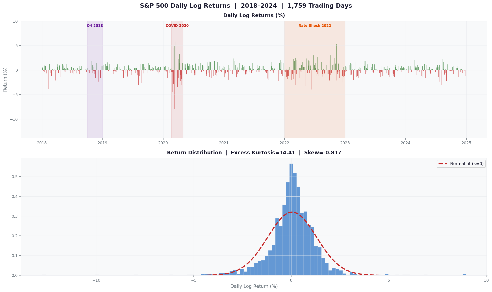
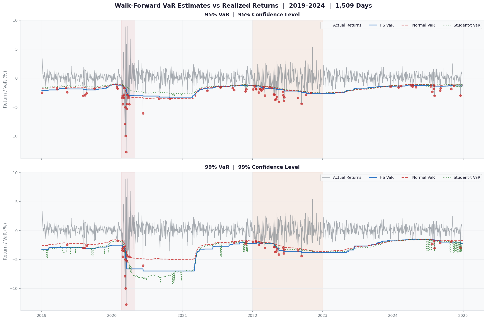
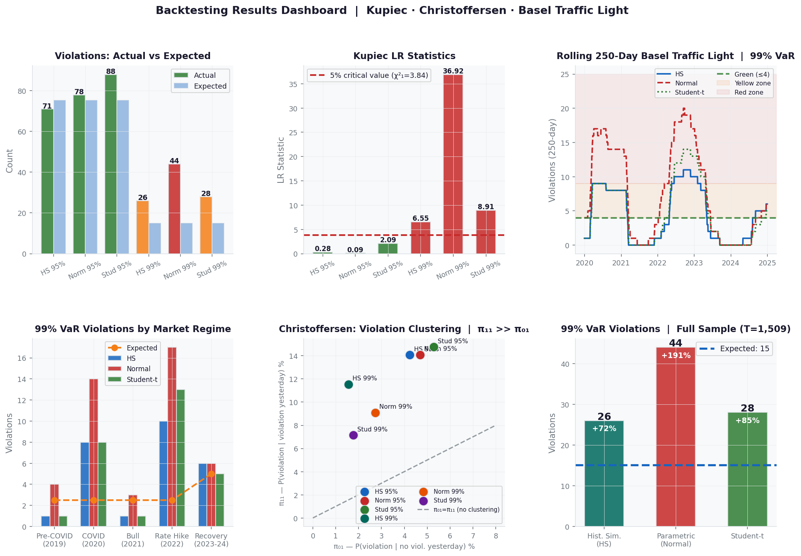
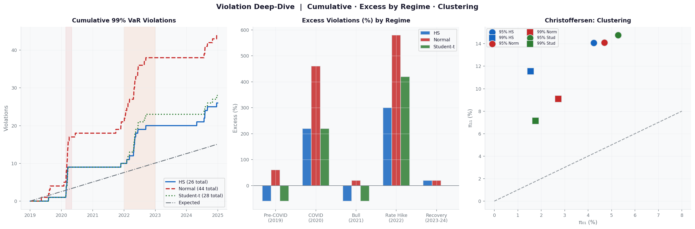
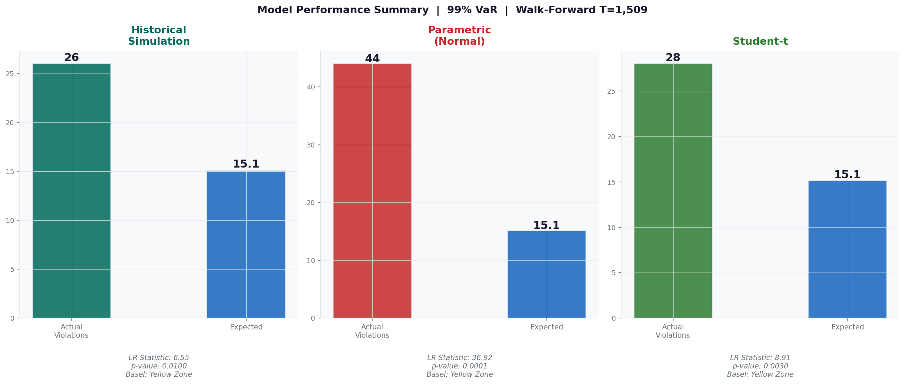

<div align="center">

# Backtesting Value-at-Risk Models Under SR 11-7

### Korvane Research Series No. 1

*A walk-forward backtest of Historical Simulation, Parametric, and Student-t VaR*  
*against S&P 500 returns (2018–2024) using Kupiec, Christoffersen, and Basel Traffic Light tests.*

[](https://python.org)
[](https://numpy.org)
[](https://pandas.pydata.org)
[](https://scipy.org)
[](LICENSE)

**Author:** Niraj Neupane, CA (ICAI) · Quantitative Developer & Founder, Korvane & Calderyn Institute  
**SSRN:** *Forthcoming* · **Series:** Korvane Research Series No. 1

</div>

---

## Abstract

This paper backtests three Value-at-Risk (VaR) models — Historical Simulation, Parametric (Normal), and Student-t — against S&P 500 daily returns from January 2018 through December 2024. The study uses a **walk-forward design**: each model is recalibrated daily on the previous 250 trading days and tested on the *next* day's actual return — producing 1,509 genuine out-of-sample forecasts per model.

Three tests are applied: **Kupiec POF (1995)**, **Christoffersen Conditional Coverage (1998)**, and the **Basel Committee Traffic Light**, all under the SR 11-7 model risk framework (superseded by SR 26-2 in April 2026).

**Key finding:** At 99% confidence, all three models fail unconditional coverage — but not equally. Parametric Normal is the worst offender (44 violations, LR = 36.92, p < 0.0001) versus HS (26, LR = 6.55) and Student-t (28, LR = 8.91). The 2022 rate-hiking bear market caused *more* excess violations than the sharper COVID crash. None of the models reached Basel's Green zone in 2024.

---

## Repository Contents

| File | Description |
|:---|:---|
| `Neupane_2026_Backtesting_VaR_SR11-7.pdf` | Full research paper (PDF) |
| `Neupane_2026_Backtesting_VaR_SR11-7.docx` | Full research paper (Word) |
| `Data_S_P500.csv` | S&P 500 daily prices and log returns (2018–2024 · 1,759 days) |
| `Data_python.ipynb` | Python notebook — VaR estimation + full backtesting pipeline |
| `Code.html` | Rendered HTML output of the analysis notebook |

---

## S&P 500 Returns — 2018–2024



---

## Data

### `Data_S_P500.csv`

| Column | Description |
|:---|:---|
| `Date` | Trading date (YYYY-MM-DD) |
| `Price` | S&P 500 daily closing price |
| `Log_Return` | Daily log return: ln(Pₜ / Pₜ₋₁) |
| `Log_Return_%` | Log return expressed as percentage |

**Coverage:** January 3, 2018 – December 30, 2024 · **1,759 trading days**  
**Out-of-sample:** January 2, 2019 – December 30, 2024 · **1,509 forecast days**

| Period | Obs | Mean (%) | Std Dev (%) | Min (%) | Max (%) | Skewness | Ex. Kurtosis |
|:---|:---:|:---:|:---:|:---:|:---:|:---:|:---:|
| Full Sample | 1,759 | 0.045 | 1.248 | −12.765 | 8.968 | −0.816 | **14.415** |
| Pre-COVID (2018–2019) | 502 | 0.036 | 0.944 | −4.184 | 4.840 | −0.612 | 3.641 |
| COVID Crisis (2020) | 253 | 0.060 | 2.185 | −12.765 | 8.968 | −0.866 | 8.507 |
| Post-COVID Bull (2021) | 252 | 0.095 | 0.826 | −2.601 | 2.351 | −0.369 | 0.698 |
| Rate Hike Bear (2022) | 251 | −0.086 | 1.524 | −4.420 | 5.395 | −0.009 | 0.336 |
| Recovery (2023–2024) | 501 | 0.086 | 0.811 | −3.043 | 2.498 | −0.285 | 0.734 |

Excess kurtosis of **14.41** and Jarque–Bera = **15,424.4 (p < 0.0001)** confirm severe non-normality.  
Negative skewness (−0.816) reflects the well-documented leverage effect in equity returns.

---

## Walk-Forward VaR Estimates vs Realized Returns



---

## Methodology

### Three VaR Models

**Historical Simulation (HS)** — Empirical (1−α)-th percentile of the trailing 250-day return window. No distributional assumption. Captures fat tails automatically but lags during regime shifts.

**Parametric (Normal)** — Assumes normally distributed returns. Estimates μ and σ from the trailing 250-day window daily. Fast and interpretable but underestimates tail risk by design.

**Student-t** — Adds a degrees-of-freedom parameter ν, estimated by maximum likelihood on each daily rolling window. Explicitly models fat tails.

### Walk-Forward Design

```
For each day t from 250 to 1,759:
  ├── Fit model on returns[t-250 : t]   ← trailing 250 days only
  ├── Forecast VaR for day t+1          ← out-of-sample
  └── Record violation if return[t] < −VaR
```

1,509 out-of-sample forecasts per model. Zero look-ahead bias.

### Backtesting Tests

| Test | What It Checks | Statistic |
|:---|:---|:---:|
| **Kupiec POF (1995)** | Observed violation rate = theoretical rate | χ²(1) |
| **Christoffersen CC (1998)** | Coverage + independence from clustering | χ²(2) |
| **Basel Traffic Light** | Violation count → Green / Yellow / Red zone | Count |

---

## Backtesting Results Dashboard



---

## Results

### Kupiec Proportion of Failures Test (T = 1,509)

| Model | Confidence | Violations | Expected | LR Statistic | p-value | Decision |
|:---|:---:|:---:|:---:|:---:|:---:|:---:|
| Historical Simulation | 95% | 71 | 75.5 | 0.282 | 0.596 | ✅ PASS |
| Parametric (Normal) | 95% | 78 | 75.5 | 0.090 | 0.764 | ✅ PASS |
| Student-t | 95% | 88 | 75.5 | 2.091 | 0.148 | ✅ PASS |
| Historical Simulation | 99% | 26 | 15.1 | 6.551 | 0.010 | ❌ REJECT |
| Parametric (Normal) | 99% | **44** | 15.1 | **36.917** | <0.0001 | ❌ REJECT |
| Student-t | 99% | 28 | 15.1 | 8.910 | 0.003 | ❌ REJECT |

### Christoffersen Conditional Coverage Test

| Model | Conf | π₀₁ (%) | π₁₁ (%) | LR Independence | LR Joint CC | Ind. | CC |
|:---|:---:|:---:|:---:|:---:|:---:|:---:|:---:|
| Historical Simulation | 95% | 4.24 | 14.08 | 9.989 (p=0.002) | 10.270 (p=0.006) | ❌ | ❌ |
| Parametric (Normal) | 95% | 4.69 | 14.10 | 9.526 (p=0.002) | 9.616 (p=0.008) | ❌ | ❌ |
| Student-t | 95% | 5.28 | 14.77 | 10.008 (p=0.002) | 12.099 (p=0.002) | ❌ | ❌ |
| Historical Simulation | 99% | 1.55 | 11.54 | 6.834 (p=0.009) | 13.386 (p=0.001) | ❌ | ❌ |
| Parametric (Normal) | 99% | 2.73 | 9.09 | 4.017 (p=0.045) | 40.934 (p<0.0001) | ❌ | ❌ |
| Student-t | 99% | 1.76 | 7.14 | 2.593 (p=0.107) | 11.502 (p=0.003) | ✅ | ❌ |

### Basel Traffic Light — Trailing 250 Days (2024)

| Model | Violations | Expected | Zone | Capital Multiplier |
|:---|:---:|:---:|:---:|:---:|
| Historical Simulation | 6 | 2.5 | 🟡 Yellow | 3.50× |
| Parametric (Normal) | 6 | 2.5 | 🟡 Yellow | 3.50× |
| Student-t | 5 | 2.5 | 🟡 Yellow | 3.40× |

---

## Violation Analysis



---

## Subperiod Analysis — 99% VaR Violations

| Period | Obs | Expected | HS | Excess | Normal | Excess | Student-t | Excess |
|:---|:---:|:---:|:---:|:---:|:---:|:---:|:---:|:---:|
| Pre-COVID (2019) | 252 | 2.5 | 1 | −60% | 4 | +59% | 1 | −60% |
| COVID Crisis (2020) | 253 | 2.5 | 8 | +216% | 14 | +453% | 8 | +216% |
| Post-COVID Bull (2021) | 252 | 2.5 | 1 | −60% | 3 | +19% | 1 | −60% |
| **Rate Hike Bear (2022)** | 251 | 2.5 | **10** | **+298%** | **17** | **+577%** | **13** | **+418%** |
| Recovery (2023–2024) | 501 | 5.0 | 6 | +20% | 6 | +20% | 5 | 0% |

---

## Model Performance Summary



---

## Key Findings

**1. All three models fail at 99% — but not equally.**  
Parametric Normal fails by the widest margin (LR = 36.92 vs 6.55 and 8.91). All three pass at 95%.

**2. Violation clustering is structural — not distributional.**  
Every model fails Christoffersen independence at 95%. Only Student-t passes at 99%, but still fails the joint test. Clustering during stress is baked into fixed-window VaR estimation.

**3. Slow regime shifts are harder than sudden shocks.**  
The 2022 rate-hiking bear market caused *more* excess violations than the sharper COVID crash — because a fixed 250-day window absorbs sudden spikes quickly but lags behind slow, grinding regime changes.

**4. None of the models are Basel Green in 2024.**  
All three land in the Yellow zone even in a relatively calm year — an operational concern for any firm without regime-detection or volatility overlay.

**5. Walk-forward design changes the conclusion.**  
Static, full-sample backtests tell a meaningfully different story. Walk-forward methodology is more demanding, more honest, and more aligned with regulatory validation practice.

---

## SR 11-7 / SR 26-2 Implications

- Parametric Normal failure mode must be **documented in validation records**
- Violation clustering must be **investigated** — not just counted
- Subperiod backtesting (Table 7) should be **standard**, not optional
- Basel Yellow zone outcomes require **documented management response**
- **SR 26-2** (April 2026): retains backtesting as core; shifts to materiality-proportionate oversight

---

## Toward AI-Augmented VaR — Korvane ML-LiqVaR

The structural failure here — fixed-window estimators lagging slow regime transitions — motivates:

| Component | Role |
|:---|:---|
| **GARCH-Markov Switching** | Regime detection before the window catches up |
| **XGBoost** | Nonlinear macro-variable relationships |
| **LSTM** | Violation clustering patterns over time |
| **SHAP** | Interpretable forecasts for SR 26-2 regulatory review |

The walk-forward three-test methodology here serves as the validation baseline for ML-LiqVaR.

---

## Citation

```bibtex
@article{neupane2026var,
  author  = {Neupane, Niraj},
  title   = {Backtesting Value-at-Risk Models Under SR 11-7},
  journal = {Korvane Research Series},
  number  = {1},
  year    = {2026}
}
```

---

## References

- Christoffersen, P. F. (1998). Evaluating interval forecasts. *International Economic Review*, 39(4), 841–862.
- Federal Reserve. (2011). *Supervisory guidance on model risk management* (SR 11-7).
- Federal Reserve, OCC, & FDIC. (2026). *Revised guidance on model risk management* (SR 26-2).
- Kupiec, P. H. (1995). Techniques for verifying the accuracy of risk measurement models. *Journal of Derivatives*, 3(2), 73–84.
- McNeil, A. J., Frey, R., & Embrechts, P. (2015). *Quantitative risk management* (Revised ed.). Princeton University Press.

---

<div align="center">

**Niraj Neupane**  
Quantitative Developer · Founder, Korvane & Calderyn Institute  
MS Financial Economics · University of Wisconsin–Madison · Chartered Accountant (ICAI)

[github.com/nirajneupane17](https://github.com/nirajneupane17)

*Built with Python · NumPy · Pandas · SciPy · Matplotlib*

</div>
